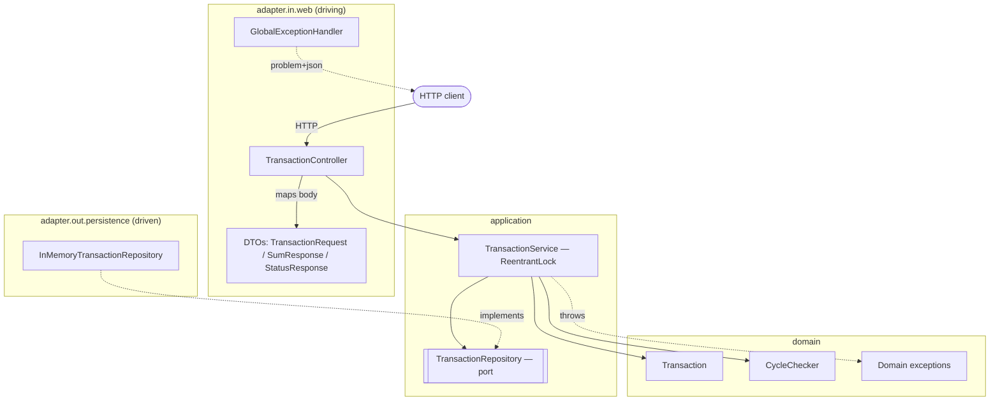
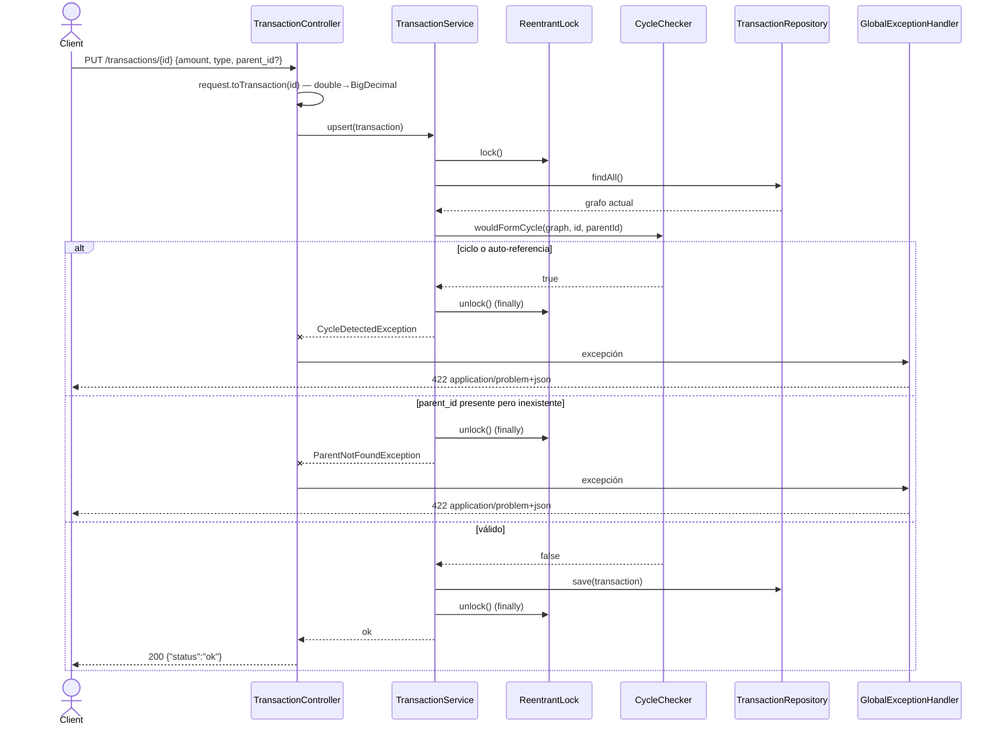

# Transaction Service

Servicio REST que registra transacciones sobre un grafo padre-hijo y calcula la **suma transitiva** del `amount` de una transacción más el de todos sus descendientes. El almacenamiento es **en memoria** (sin base de datos), por decisión de alcance.

- **Stack:** Java 21 · Spring Boot 4.0.7 · Maven
- **Arquitectura:** hexagonal (dominio / aplicación / adaptadores in-web y out-persistence)
- **Persistencia:** in-memory concurrente (`ConcurrentHashMap` + índice de hijos)

## Endpoints

Base path: `/transactions` · puerto por defecto `8080`.

| Método | Path | Request | Response | Códigos |
|--------|------|---------|----------|---------|
| `PUT` | `/transactions/{id}` | `{ "amount": number, "type": string, "parent_id": number? }` | `{ "status": "ok" }` | `200` · `400` body inválido · `422` (ver abajo) |
| `GET` | `/transactions/sum/{id}` | — | `{ "sum": number }` | `200` · `404` si el id no existe |
| `GET` | `/transactions/types/{type}` | — | `[id, ...]` (array de long) | `200` (vacío ⇒ `[]`, nunca `404`) |

- `PUT` es **idempotente**: tanto el alta como la actualización devuelven `200 {"status":"ok"}`.
- `parent_id` es opcional (su ausencia ⇒ transacción raíz). Si se envía, **debe existir** una transacción con ese id.
- El matching de `type` es **case-sensitive** (`"cars"` ≠ `"Cars"`).

### Errores (Problem Details, RFC 9457)

Todas las respuestas de error usan `Content-Type: application/problem+json` con los campos `type`, `title`, `status`, `detail`. Mapeo:

| Status | Condición |
|--------|-----------|
| `400` | Body inválido o malformado (`amount`/`type` ausentes, JSON inválido) |
| `404` | `GET /sum/{id}` con id inexistente |
| `422` | `parent_id` inexistente, o la operación formaría un ciclo / auto-referencia |

## Build & Run

Requiere JDK 21 (para `mvnw`) o solo Docker (el build de la imagen no necesita JDK local).

```bash
# Compilar y correr toda la pirámide de tests (unit + slice + e2e)
./mvnw verify

# Levantar el servicio (Tomcat embebido en :8080)
./mvnw spring-boot:run
```

### Docker

```bash
docker build -t transaction-service .
docker run -p 8080:8080 transaction-service
```

La imagen es multi-stage (build con Maven → runtime JRE mínimo), corre como usuario **non-root** y expone un `HEALTHCHECK` contra `/actuator/health`.

### Documentación de la API y salud

Con el servicio corriendo:

- OpenAPI JSON: `http://localhost:8080/v3/api-docs`
- Swagger UI: `http://localhost:8080/swagger-ui.html`
- Healthcheck: `http://localhost:8080/actuator/health`

Contrato estático versionado (sin levantar la app): [`docs/openapi.yaml`](docs/openapi.yaml).

### Ejemplo (la secuencia del enunciado)

```bash
curl -X PUT localhost:8080/transactions/10 -H 'Content-Type: application/json' -d '{"amount":5000,"type":"cars"}'
curl -X PUT localhost:8080/transactions/11 -H 'Content-Type: application/json' -d '{"amount":10000,"type":"shopping","parent_id":10}'
curl -X PUT localhost:8080/transactions/12 -H 'Content-Type: application/json' -d '{"amount":5000,"type":"shopping","parent_id":11}'

curl localhost:8080/transactions/sum/10      # {"sum":20000.0}
curl localhost:8080/transactions/sum/11      # {"sum":15000.0}
curl localhost:8080/transactions/types/cars  # [10]
```

## Estructura del proyecto

```
src/main/java/io/github/matiasmazzu/transactionservice/
├── domain/            # Transaction (record inmutable), CycleChecker, excepciones
├── application/       # TransactionService (orquesta; aloja el ReentrantLock) + port
└── adapter/
    ├── in/web/        # Controller, DTOs, GlobalExceptionHandler, OpenApiConfig
    └── out/persistence/  # InMemoryTransactionRepository (store + índice de hijos)
```

La dependencia apunta hacia adentro: `adapter.in.web` → `application` → `domain`; el dominio no conoce Spring ni el transporte.

### Componentes (hexagonal)



El puerto `TransactionRepository` vive en `application`; el adapter de persistencia lo implementa (inversión de dependencias). Toda dependencia apunta hacia el dominio.

### Camino de escritura (PUT) con el lock



Validación y mutación ocurren dentro de la misma sección crítica (`lock()`…`unlock()` en `finally`); el `unlock` se ejecuta en todas las ramas, incluso ante excepción.

## Decisiones

Las decisiones de diseño están registradas como ADRs en [`docs/adr/`](docs/adr/) — cada una con su contexto, la alternativa descartada y la consecuencia:

- [ADR-0001](docs/adr/0001-almacenamiento-in-memory.md) — Almacenamiento in-memory
- [ADR-0002](docs/adr/0002-put-upsert-idempotente.md) — `PUT` upsert idempotente
- [ADR-0003](docs/adr/0003-bigdecimal-en-dominio.md) — `BigDecimal` en dominio, `double` en el borde
- [ADR-0004](docs/adr/0004-reentrantlock-en-application.md) — `ReentrantLock` en la capa de aplicación
- [ADR-0005](docs/adr/0005-lecturas-lock-free.md) — Lecturas lock-free (weakly consistent)
- [ADR-0006](docs/adr/0006-scan-para-findbytype.md) — Scan para `findByType` (sin índice de tipos)
- [ADR-0007](docs/adr/0007-traversal-iterativo.md) — Traversal iterativo
- [ADR-0008](docs/adr/0008-errores-problem-details.md) — Errores centralizados (Problem Details)
- [ADR-0009](docs/adr/0009-spring-boot-4.md) — Spring Boot 4.0.x sobre 3.x

## Alcance

**Incluido:** registro/actualización idempotente, suma transitiva, listado por tipo, errores Problem Details (`400`/`404`/`422`), concurrencia de escritura con `ReentrantLock`, documentación OpenAPI, imagen Docker non-root con healthcheck, y un test e2e que reproduce la secuencia del enunciado.

**Fuera de alcance (decisiones conscientes):** persistencia durable (el store es in-memory), autenticación/autorización, borrado de transacciones, paginación, índice por tipo, despliegue/CD y coordinación multi-instancia (el lock es in-process, válido para una sola instancia).

---

El historial de commits sigue un flujo TDD incremental (red → green → refactor), una story a la vez; ver `git log` como evidencia del proceso.
